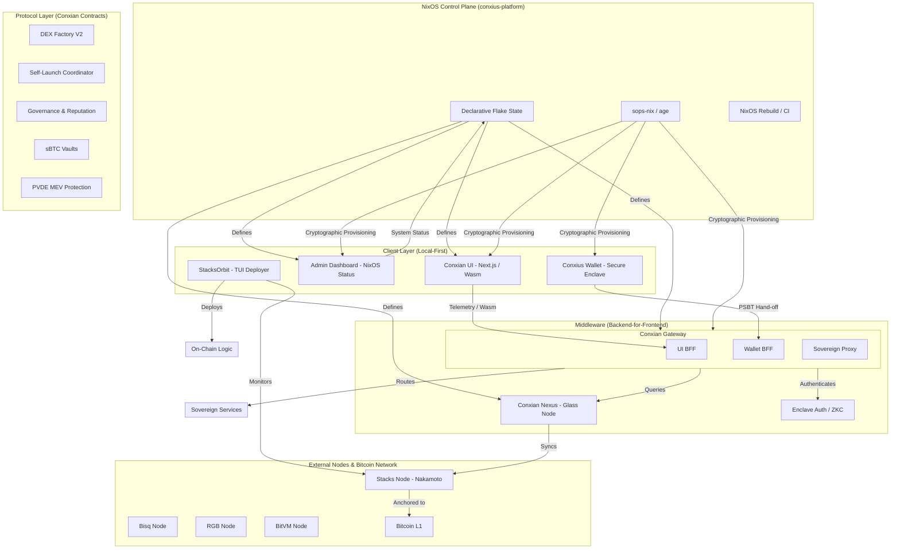

# Conxian System Architecture: Sovereign Declarative Topology

This graph represents the holistic viewpoint of the Conxian organization, transitioning from centralized orchestration to a decentralized NixOS control plane.

## Enhancements & Roadmap Alignment
- **NixOS Control Plane**: Transitioned from Master Control Center to a declarative, reproducible state model.
- **BFF Topology**: Gateway refactored into domain-specific BFFs for improved security and isolation.
- **Local-First Execution**: Clients leverage Wasm-compiled lib-conxian-core for local cryptographic validation.
- **MEV Protection**: Implementation of Practical Verifiable Delay Encryption (PVDE) to neutralize front-running.

## Repository Roles
| Repository | Role |
| :--- | :--- |
| **conxius-platform** | Declarative Control Plane |
| **lib-conxian-core** | Shared Primitives & Wasm SDK |
| **conxian-ui** | Local-First Web Dashboard |
| **admin-dashboard** | Infrastructure Monitoring |
| **Conxian** | Smart Contracts (L1/L2) |
| **conxius-wallet** | Mobile Sovereign Enclave |
| **stacksorbit** | TUI Deployment & Monitoring |
| **conxian-nexus** | Glass Node / State Sync |
