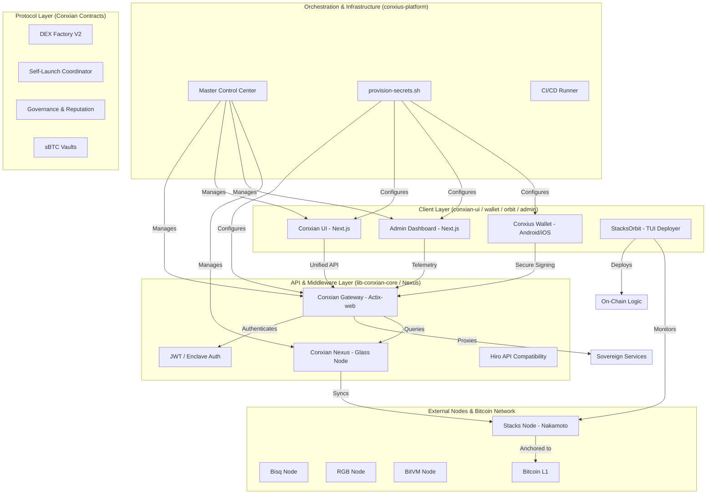

# Conxian System Architecture: Full Organization Viewpoint

This graph represents the holistic viewpoint of the Conxian organization and how `conxius-platform` orchestrates the ecosystem.

## Enhancements & Roadmap Alignment
- **Nakamoto Readiness**: All components are aligned with Stacks Epoch 3.1 (Clarity 4).
- **Institutional Scale**: The Gateway (Gateway/Core) provides the compliance and performance layer for enterprise adoption.
- **Sovereign Integration**: Roadmap includes native RGB asset support and BitVM-based computation proofs.
- **Root-Up Ethos**: Reliability is built from the core libraries up to the user interfaces.

## Repository Roles
| Repository | Role |
| :--- | :--- |
| **conxius-platform** | Master Orchestrator |
| **lib-conxian-core** | Shared Primitives & Gateway |
| **conxian-ui** | Web Dashboard |
| **admin-dashboard** | Internal Telemetry Dashboard |
| **Conxian** | Smart Contracts (L1/L2) |
| **conxius-wallet** | Mobile Sovereign Enclave |
| **stacksorbit** | TUI Deployment & Monitoring |
| **conxian-nexus** | Glass Node / State Sync |
| **conxian-labs-site** | Public Information |
