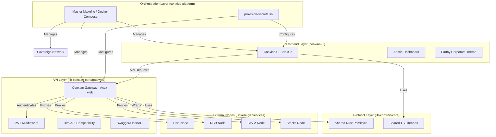

# Conxian System Architecture

This graph represents the full viewpoint of the `conxius-platform` and its constituent services.

## Enhancements & Alignment
- **Unified Entry Point**: All client requests flow through the Gateway.
- **Shared Primitives**: Both Gateway and UI (via SDK) share logic defined in `lib-conxian-core`.
- **Theme Consistency**: UI follows the Earthy Corporate Finance palette as defined in `globals.css`.
- **Sovereign Integration**: Roadmap includes full integration of Bisq, RGB, and BitVM nodes.
