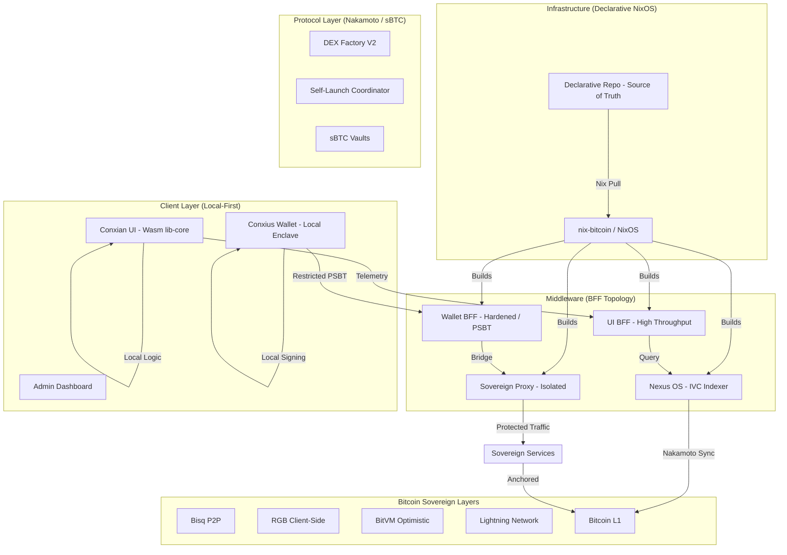
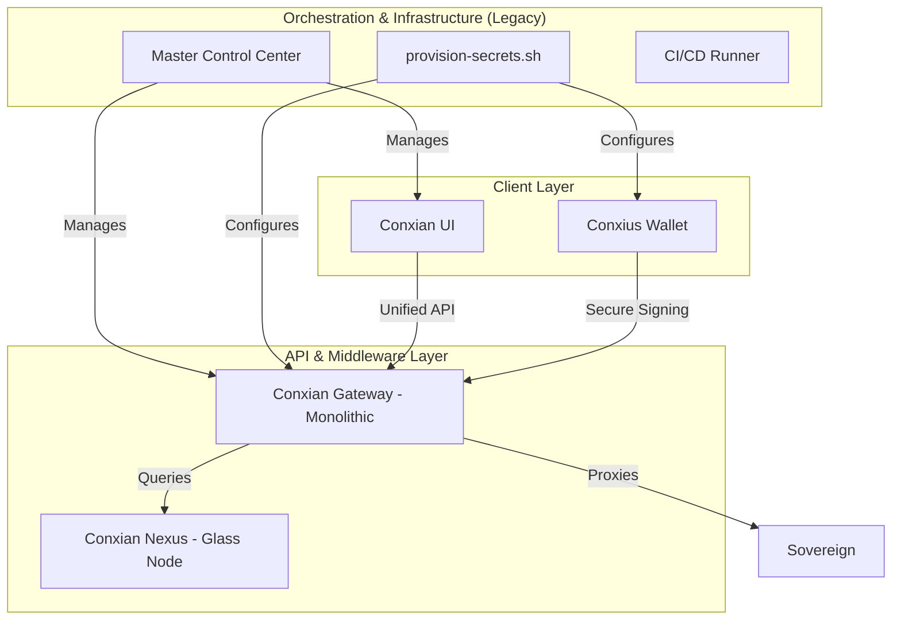

# Conxian System Architecture: Holistic Viewpoint

> [!IMPORTANT]
> **Architectural Transition in Progress**: The platform is migrating from a centralized orchestration model to a decentralized, local-first, BFF-driven topology. See [SOVEREIGN_REPR_2026.md](./docs/architecture/SOVEREIGN_REPR_2026.md) for the authoritative redesign specification.

## 1. Proposed Sovereign Architecture (Target State)
The target architecture dismantling the "Master Control Center" in favor of declarative NixOS configuration and Backend-for-Frontend (BFF) routing.

## 2. Legacy Orchestration (Deprecated)
The following graph represents the legacy hub-and-spoke model which is being phased out due to centralization risks.

## Repository Roles
| Repository | Role |
| :--- | :--- |
| **conxius-platform** | Control Plane (Migrating to NixOS) |
| **lib-conxian-core** | Shared Primitives (Wasm-ready) |
| **conxian-ui** | Web Dashboard (Local-first) |
| **conxius-wallet** | Mobile Sovereign Enclave |
| **conxian-nexus** | Nexus OS / IVC Indexer |

For full details, see [REPOSITORY_TAXONOMY](docs/REPOSITORY_TAXONOMY.md).
