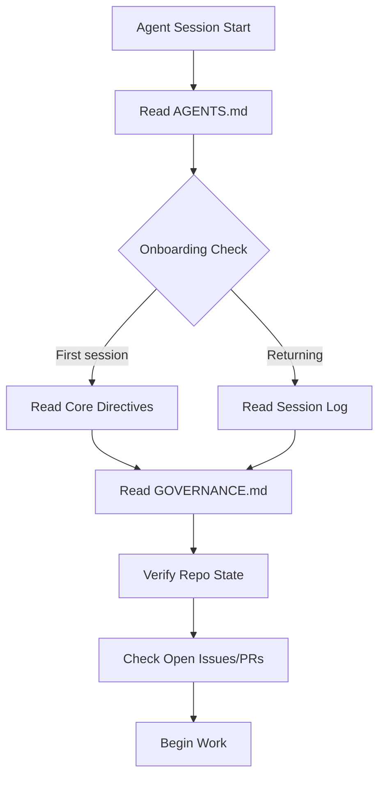
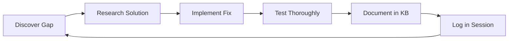

# Agent Onboarding Guide

This document defines the canonical pattern for onboarding AI agents to the Conxian ecosystem. It covers discovery, knowledge base usage, GitHub integration, self-enhancement, and swarm coordination.

---

## Quick Start (30-Second Induction)

Every agent session starts with these mandatory steps:

```bash
# 1. Read the knowledge base (AGENTS.md)
cat AGENTS.md

# 2. Check current session log for recent work
grep -A 20 "Session Log" AGENTS.md

# 3. Verify repo state
git status && git pull origin main

# 4. Check open issues and PRs
gh issue list --state open && gh pr list --state open
```

---

## Entry Point Discovery

Agents should use the versioned repository discovery protocol when it is available. The protocol is zero-network and repository-local; it does not execute skills or commands.

### Versioned Protocol Entrypoint

The machine-readable entrypoint is [`.agents/manifest.json`](../.agents/manifest.json). It declares an explicit ordered allowlist of required context, optional context, and the metadata-only skill registry at [`.agents/skills/registry.json`](../.agents/skills/registry.json). The checked-in schemas are [`schemas/agent-manifest.schema.json`](../schemas/agent-manifest.schema.json) and [`schemas/agent-skill-registry.schema.json`](../schemas/agent-skill-registry.schema.json).

The current protocol major version is `1`. Discovery starts at the requested directory (or the current working directory), walks upward only until it finds `.agents/manifest.json`, and treats that manifest's repository as the root. Required context is read in ascending priority order:

1. `AGENTS.md`
2. `GOVERNANCE.md`
3. `docs/AGENT_ONBOARDING.md`
4. `docs/SESSION_CONTINUITY.md`

Optional context is read only when explicitly requested. The default active `agent-onboarding` skill is loaded as metadata plus inert Markdown content; registry entries are manual-activation metadata and never imply automatic execution.

The checked-in JSON Schemas validate contract structure and local field constraints. Runtime discovery additionally enforces cross-item and filesystem invariants that JSON Schema cannot express here: unique context paths across required and optional entries, unique priorities in strict required-then-optional ascending order, unique skill IDs and paths, unique capabilities, active defaults, at least one active default skill, frontmatter identity, and in-root real-path/symlink containment.

### Discovery CLI

Run from the repository root:

```bash
pnpm --silent agent-discovery --json
pnpm --silent agent-discovery --json --include-optional
pnpm --silent agent-discovery --json --skill agent-onboarding
```

Run from a nested directory by setting the search start directory:

```bash
pnpm --silent agent-discovery --json --root services/admin-dashboard
```

`--skill` may be repeated to select distinct active skills explicitly. When any `--skill` flag is provided, it replaces the registry's default selection; repeating the same skill ID is rejected with a deterministic `duplicate-entry` error rather than silently selecting it twice. `--root` changes only the upward-search starting point; it does not bypass repository containment checks. JSON output uses repository-relative paths and omits timestamps by default, so repeated runs are deterministic.

### Version and Failure Behavior

- Unsupported protocol/manifest/registry major versions, malformed contracts, duplicate declarations, unsafe paths, missing required files, and selected-skill failures fail closed.
- Absolute paths, `..` traversal, backslash/drive paths, and symlinks resolving outside the repository root are rejected.
- The runtime checks unique context priorities and strict ascending order across required entries followed by optional entries; it does not sort declarations silently.
- Missing declared optional files produce warnings; their content is read only when `--include-optional` is used.
- Discovery reads only declared files and never scans unrelated files or executes skill content.

### Compatibility Fallback

Repositories without a valid manifest can still use the manual onboarding sequence below: read `AGENTS.md`, then `GOVERNANCE.md`, then `docs/AGENT_ONBOARDING.md`, and `docs/SESSION_CONTINUITY.md`. This fallback is for compatibility and human-guided onboarding; automated discovery must not silently downgrade an invalid manifest or bypass its failure result.

The current manifest context signals are:

| Signal | Location | Priority | Contract |
|--------|----------|----------|----------|
| `AGENTS.md` | Repository root | 10 | **REQUIRED** - primary knowledge base |
| `GOVERNANCE.md` | Repository root | 20 | **REQUIRED** - governance rules |
| `docs/AGENT_ONBOARDING.md` | `docs/` | 30 | **REQUIRED** - onboarding protocol |
| `docs/SESSION_CONTINUITY.md` | `docs/` | 40 | **REQUIRED** - session handover |
| `docs/REPOSITORY_TAXONOMY.md` | `docs/` | 50 | Optional cross-repo context |
| `docs/INFORMATION_HIERARCHY.md` | `docs/` | 60 | Optional documentation navigation |

### Auto-Discovery Sequence



---

## Knowledge Base (AGENTS.md) Usage

### Reading Hierarchy

AGENTS.md contains four tiers of information:

| Section | Purpose | When to Read |
|---------|---------|--------------|
| **Core Directives** | Immutable rules | Every session |
| **Agent Learnings** | Historical context | On-demand |
| **Skills & Tools Reference** | Capability mapping | Before complex tasks |
| **Session Log** | Recent work continuity | **Every session** |

### Mandatory Session Log Entry

After **every** session, append to the Session Log:

```markdown
### YYYY-MM-DD — Brief Session Title
**Trigger**: (issue #, PR #, or task description)

**What was done**:
- Concrete bullet points of changes
- Files touched
- Tests run

**Key discoveries**:
- Patterns uncovered
- Constraints found
- Architecture decisions

**Files touched**: (paths modified or created)

**Gaps identified**: (what's still missing)

**Gotchas**: (anything that tripped you up)
```

### Knowledge Update Triggers

Update AGENTS.md when you discover:

| Trigger | Update Type |
|---------|-------------|
| New API endpoint | Update API Surface count + list |
| New workflow file | Update CI Workflows count |
| New test file | Update Test Coverage count |
| New pattern | Add to Agent Learnings |
| New repo dependency | Update Cross-Repo Dependencies |
| New gap discovered | Add to Key Gaps Still Open |

---

## GitHub Integration Patterns

### Issue Workflow

```
1. Check existing issues before creating
2. Use conventional format: "type(scope): description (#issue)"
3. Link PRs to issues with "Fixes #N" or "Relates to #N"
4. Update issue status after work completion
```

### PR Workflow

```bash
# 1. Create feature branch
git checkout -b feat/description

# 2. Make changes, commit with conventional format
git commit -m "feat(scope): description"

# 3. Push and create PR
git push -u origin feat/description
gh pr create --title "feat(scope): description" --body "Fixes #N"

# 4. Request review, address feedback
# 5. Squash merge to main
```

### Commit Message Convention

| Type | Use Case |
|------|----------|
| `feat:` | New feature |
| `fix:` | Bug fix |
| `docs:` | Documentation only |
| `chore:` | Maintenance (deps, CI) |
| `refactor:` | Code restructuring |
| `perf:` | Performance improvement |

---

## Self-Enhancement Patterns

### Capability Discovery Loop



### Knowledge Upgrade Checklist

After completing work that improves the system:

- [ ] Update relevant type counts in Repository Knowledge Graph
- [ ] Add session log entry with discoveries
- [ ] Update skills trigger thresholds if changed
- [ ] Document new patterns in Agent Learnings
- [ ] Update cross-references if new connections found

### Multi-Agent Knowledge Transfer

When delegating to sub-agents:

1. **Provide full context** in task prompt
2. **Specify deliverable format**
3. **Request session log entry** for their work
4. **Merge findings** into parent session log
5. **Update KB** if new patterns discovered

---

## Conxian Working Rules Adherence

### Core Directives (Enforced)

| Directive | Requirement |
|-----------|-------------|
| OpenSpec First | All changes require proposal or change artifact |
| Gateway Truth | Gateway is authoritative for protocol state |
| Bitcoin Native | Use `burn-block-height` for anchoring |
| Sovereign Design | Use Forest Green `#2E403B`, Nakamoto Gold `#D4A017` |
| Sentinel Security | Never hardcode secrets, use `provision-secrets.sh` |

### Implementation Standards

| Standard | Application |
|----------|-------------|
| TypeScript | Use strict types, no `any` |
| Rust (Gateway) | Actix-web, tokio, modular boundaries |
| Clarity (Contracts) | Mathematical certainty, sBTC integration |
| API Routes | Always use `validateAdminAuth()` |

---

## Swarm Coordination

Issue #1163 adds a versioned, transport-neutral `conxian.swarm` v1 protocol for exchanging and validating coordination state. The normative contract is [`openspec/specs/swarm-coordination-v1.spec.md`](../openspec/specs/swarm-coordination-v1.spec.md); the checked-in interchange contract is [`schemas/agent-swarm.schema.json`](../schemas/agent-swarm.schema.json), and the side-effect-free TypeScript implementation is [`scripts/agent-coordination.ts`](../scripts/agent-coordination.ts). The implementation normalizes caller-provided data and returns validation, ordering, digest, conflict, provenance, freshness, and resumability evidence.

`conxian.swarm` is **not** a scheduler, worker pool, queue, broker, or provider runtime. It does not open network connections, deliver messages, execute tasks or skills, select an executor, issue credentials, or maintain shared process state. Transport delivery, authentication, retries at the provider boundary, and runtime scheduling remain responsibilities of consuming systems.

### Agent Types and Their Roles

| Agent Type | Use Case | Tools Available |
|------------|----------|----------------|
| `bash-runner` | Tests, builds, CLI | terminal |
| `code-explorer` | Understanding code, tracing | terminal |
| `general-purpose` | Multi-step tasks | terminal, file_editor, task_tracker |
| `web-researcher` | External research | browser_tool_set |

### `conxian.swarm` protocol surface

**Envelope and lifecycle.** Core messages use `envelope.v1` with `message_id`, `message_type`, `sender`, `recipient`, `correlation_id`, optional `causation_id`, scoped `idempotency_key`, lifecycle state/sequence, expiry, payload, links, and an integrity digest. Message types are `task`, `ack`, `progress`, `result`, `handover`, `error`, and `cancel`. Valid lifecycle transitions are `PROPOSED → ACCEPTED → STARTED → COMPLETED|FAILED|BLOCKED|CANCELLED|EXPIRED`, with `BLOCKED → STARTED`; terminal states cannot be reopened. Normative timestamps accept zero through three fractional digits, canonicalize to UTC with exactly three millisecond digits, and reject four through nine fractional digits. Unknown fields, unsupported versions, invalid transitions, expired messages, authentication requirements, and digest mismatches fail closed.

**Decomposition and capability matching.** `task-graph.v1` represents work as a bounded DAG. Each node has a stable `task_id`, objective/schema, sorted dependencies, required/optional status, normalized capability requirements, retry/backoff/timeout policy, and links. Validation rejects duplicate IDs, missing/self dependencies, cycles, invalid limits, and retry/timeout budgets that exceed graph limits. `GraphLimits.max_context_bytes` is the effective minimum total context budget when a graph is supplied. `deterministicTopologicalOrder()` uses a stable lexical ready queue. `matchCapabilities()` normalizes lowercase capability IDs and semantic versions, checks declared constraints, treats a missing offered constraint as unmet rather than throwing, and returns candidates ordered by unmet requirements, exact-version matches, declared priority, agent ID, and instance ID. `selected_candidates` are evidence of full matches—not a scheduling command.

**Idempotent delivery and aggregation.** Envelope replays are grouped by `idempotency_scope` + `idempotency_key` and compared by canonical payload digest. Identical deliveries collapse to one unique envelope while retaining duplicate evidence; different payloads produce a replay conflict without choosing an arrival-order winner. Results use graph/task/attempt identity and an exact semantic fingerprint covering status, error, agent, evidence, artifacts, links, and other normative metadata (excluding only delivery `result_id`). Same-payload results with different semantic metadata remain conflicts. `aggregateResults()` emits deterministic `COMPLETE`, `PARTIAL`, `FAILED`, `BLOCKED`, `CONFLICT`, or `CANCELLED` outcomes: required failures block completion, optional unresolved work is partial, dependency failures propagate as blocked, and conflicting attempts remain visible as evidence. Result ordering follows graph order and stable digest/ID tie-breakers rather than transport or provider order.

**Handover and context boundary.** `handover.v1` carries graph and correlation linkage, a required `graph_digest` verified against a supplied graph, task state, artifacts/digests, decisions, conflicts with at least two distinct payload digests, risks/blockers, resume instructions, a bounded context snapshot, and digest-only integrity. `createHandover(input, graph, { allowlist, discovery, trusted_discovery_anchor })`, `validateHandover(handover, { graph, allowlist, discovery, trusted_discovery_anchor })`, resumability assessment, and handover-envelope validation/replay/deduplication all require the validated derived #1162 `ContextAllowlist`, source `DiscoveryResult`, and the same content-addressed trusted discovery anchor. The anchor is supplied out of band by a trusted adapter/deployment boundary and must never be taken from an untrusted swarm message; the pure library verifies its content binding but cannot authenticate the boundary that supplied it. Each boundary rechecks the allowlist/anchor/discovery provenance and every embedded source. Authentication is enforced only at the envelope boundary; handovers reject authentication fields rather than silently accepting them. Context packaging consumes only explicit task inputs, a versioned/digested allowlist derived from a validated #1162 discovery result and trusted anchor, validated artifact references, or marked assumptions. It preserves provenance, classification, redaction, capture/evaluated/stale/expiry state, precedence, byte/depth bounds, and truncation digests; raw secrets, hidden/unlisted files, environment dumps, and provider transcripts are not admitted. `.agents/manifest.json`, `.agents/skills/registry.json`, and declared inert skill Markdown are the only explicit hidden-source exceptions. The coordination module does not read the filesystem or resolve symlinks; adapters own those checks.

### Canonical surface and usage

Use the exported helpers in [`scripts/agent-coordination.ts`](../scripts/agent-coordination.ts), including `createEnvelope`, `validateEnvelope`, `validateTaskGraph`, `deterministicTopologicalOrder`, `matchCapabilities`, `deduplicateEnvelopes`, `aggregateResults`, `createHandover`, `validateHandover`, `packageContext`, `validateContextSnapshot`, `resolveContextSnapshot`, and `mergeContextSnapshots`. Handover, snapshot-validation, merge, and handover-envelope calls must carry `{ allowlist, discovery, trusted_discovery_anchor }` alongside the graph where applicable. `validateContextSnapshot()` has no authoritative structural-only mode; its private structural normalizer is not a handover/security boundary. `mergeContextSnapshots()` validates every input against the same provenance triple and preserves the standard derived allowlist digest. Canonical JSON sorts object keys, preserves array order, normalizes `-0`, rejects non-finite values/duplicate keys, and uses domain-separated SHA-256 digests:

```text
{ "b": 2, "a": 1 }  →  {"a":1,"b":2}
```

The canonical spec is the normative human-readable reference, while the schema is the compact machine-readable structural reference; documentation should link to both rather than copy the full contract.

### Coordination Patterns

```
┌─────────────────────────────────────────────────────────────┐
│                    Orchestrator Agent                        │
│  - Breaks down complex tasks                               │
│  - Delegates to specialized agents                          │
│  - Aggregates findings                                      │
│  - Updates KB                                               │
└─────────────────────────────────────────────────────────────┘
         │                    │                    │
         ▼                    ▼                    ▼
   ┌──────────┐        ┌──────────┐        ┌──────────┐
   │ Explorer │        │ Runner   │        │ Research │
   │ Agent    │        │ Agent    │        │ Agent    │
   └──────────┘        └──────────┘        └──────────┘
```

### Swarm Session Log Template

When coordinating multiple agents:

```markdown
### Swarm Session: [Task Description]

**Orchestrator**: [session_id]
**Sub-agents spawned**: [list with their session_ids]
**Coordination pattern**: [explain how work was distributed]

**Work distribution**:
- Agent 1: [work assigned]
- Agent 2: [work assigned]

**Aggregation**:
- [How findings were combined]
- [Conflicts resolved]

**KB updates from swarm**:
- [Changes made based on collective work]
```

---

## Multidimensional Agent Modes

Agents should operate in different modes based on task type:

### Mode 1: Exploration Mode
- Deep code understanding
- Pattern discovery
- Architecture analysis
- Output: Findings for parent agent

### Mode 2: Implementation Mode
- Feature development
- Bug fixes
- Test writing
- Output: Pull request

### Mode 3: Verification Mode
- Code review
- Test validation
- Security audit
- Output: Review comments, test results

### Mode 4: Research Mode
- External documentation
- API research
- Best practice discovery
- Output: Research brief

### Mode 5: Orchestration Mode
- Task decomposition
- Agent coordination
- KB maintenance
- Output: Session log, KB updates

---

## Session Continuity

### Between Sessions

1. **Always write session log entry** before ending
2. **Push KB updates** before ending
3. **Note incomplete work** for next session
4. **Link related issues/PRs** for context

### Returning Agent Checklist

```bash
# 1. Pull latest
git pull origin main

# 2. Read session log
grep -B2 -A10 "YYYY-MM-DD" AGENTS.md | tail -20

# 3. Check assigned issues
gh issue list --assignee @me --state open

# 4. Review incomplete work notes
cat INCOMPLETE_WORK.md 2>/dev/null || echo "No pending work"

# 5. Resume or start new
```

---

## Security and Governance

### Zero-Trust Patterns

- Never commit secrets
- Use `provision-secrets.sh` for secret management
- Validate all auth on API routes
- Log all security-relevant actions

### Governance Baseline Adherence

| Document | Authority | Override? |
|----------|-----------|----------|
| `GOVERNANCE.md` | Policy rules | Never |
| `CODEOWNERS` | Ownership | Never |
| `SECURITY.md` | Security rules | Never |
| `AGENTS.md` | Agent guidance | Document changes |

---

## Metrics and Verification

### KB Health Metrics

| Metric | Target | Check Command |
|--------|--------|---------------|
| Session log entries | Every session | `grep "^### 20" AGENTS.md | wc -l` |
| Stale branches | 0 | `git branch -r | grep -v main | wc -l` |
| KB accuracy | 100% | Manual verification per release |
| Open issues age | < 30 days | `gh issue list --state open` |

### Self-Verification Checklist

Before ending any session:

- [ ] Code changes compile/build
- [ ] Tests pass (`pnpm test` or equivalent)
- [ ] No secrets committed
- [ ] KB updated if needed
- [ ] Session log entry written
- [ ] Changes pushed to remote

---

## Quick Reference Card

```
┌────────────────────────────────────────────────────────────────┐
│                    AGENT QUICK REFERENCE                        │
├────────────────────────────────────────────────────────────────┤
│ ON START:                                                      │
│   1. cat AGENTS.md                                             │
│   2. git status && git pull                                    │
│   3. gh issue list --state open                                │
│                                                                 │
│ ON WORK:                                                       │
│   - Follow Core Directives                                      │
│   - Use conventional commits                                    │
│   - Write tests                                                 │
│   - Validate auth on routes                                     │
│                                                                 │
│ ON END:                                                        │
│   1. Update AGENTS.md if needed                                │
│   2. Write session log entry                                   │
│   3. git add . && git commit                                   │
│   4. git push                                                  │
│                                                                 │
│ EMERGENCIES:                                                   │
│   - Regressions: git revert                                     │
│   - Blocked: Document in issue, skip                             │
│   - Security: Follow SECURITY.md                                │
└────────────────────────────────────────────────────────────────┘
```

---

## Document History

| Version | Date | Changes |
|---------|------|---------|
| 1.0 | 2026-07-14 | Initial onboarding guide |
| 1.1 | 2026-07-22 | Added the versioned manifest/registry discovery protocol, CLI behavior, security boundary, and compatibility fallback |

---

© 2026 Conxian Labs. Code is Law.
