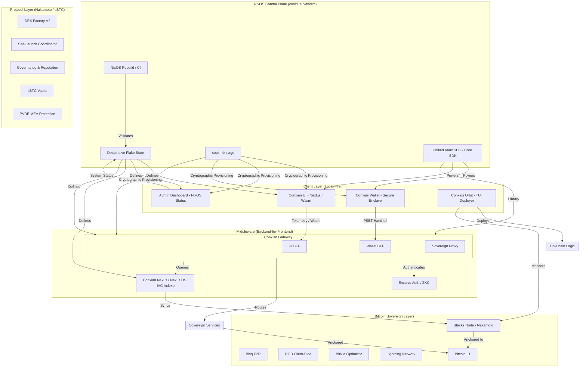
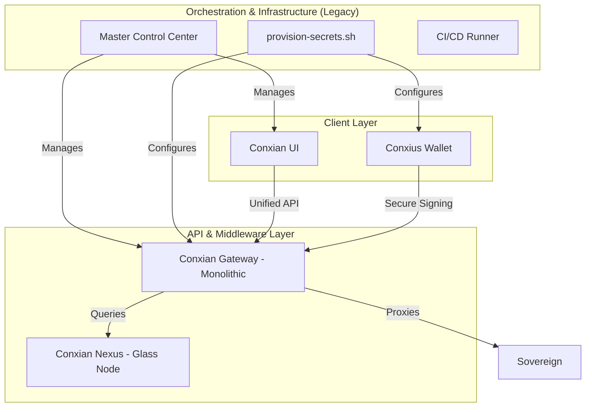

# Conxian System Architecture: Sovereign Declarative Topology

> [!IMPORTANT]
> **Architectural Transition in Progress**: The platform is migrating from a centralized orchestration model to a decentralized, local-first, BFF-driven topology. See [SOVEREIGN_REPR_2026.md](./SOVEREIGN_REPR_2026.md) for the authoritative redesign specification.

## 1. Proposed Sovereign Architecture (Target State)
This graph represents the holistic viewpoint of the Conxian organization, transitioning from centralized orchestration to a decentralized NixOS control plane.

## 2. Legacy Orchestration (Deprecated)
The following graph represents the legacy hub-and-spoke model which is being phased out due to centralization risks.

## Enhancements & Roadmap Alignment
- **NixOS Control Plane**: Transitioned from Master Control Center to a declarative, reproducible state model.
- **BFF Topology**: Gateway refactored into domain-specific BFFs for improved security and isolation.
- **Local-First Execution**: Clients leverage Wasm-compiled lib-conxian-core for local cryptographic validation.
- **MEV Protection**: Implementation of Practical Verifiable Delay Encryption (PVDE) to neutralize front-running.

## Repository Roles
| Repository | Role |
| :--- | :--- |
| **conxius-platform** | Declarative Control Plane (Migrating to NixOS) |
| **lib-conxian-core** | **Unified Vault SDK** (Core Primitive) |
| **conxian-ui** | Local-First Web Dashboard |
| **admin-dashboard** | Infrastructure Monitoring |
| **Conxian** | Smart Contracts (L1/L2) |
| **conxius-wallet** | Mobile Sovereign Enclave |
| **stacksorbit** | TUI Deployment & Monitoring |
| **conxian-nexus** | Nexus OS / Glass Node / State Sync |

For full details, see [REPOSITORY_TAXONOMY](docs/REPOSITORY_TAXONOMY.md).
